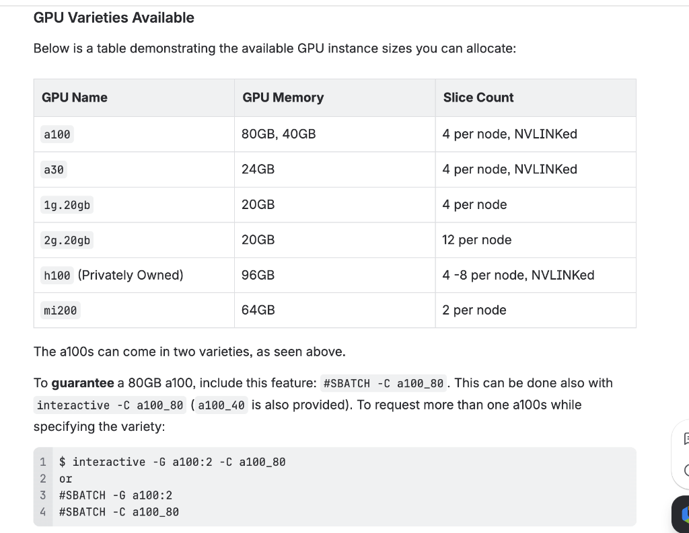
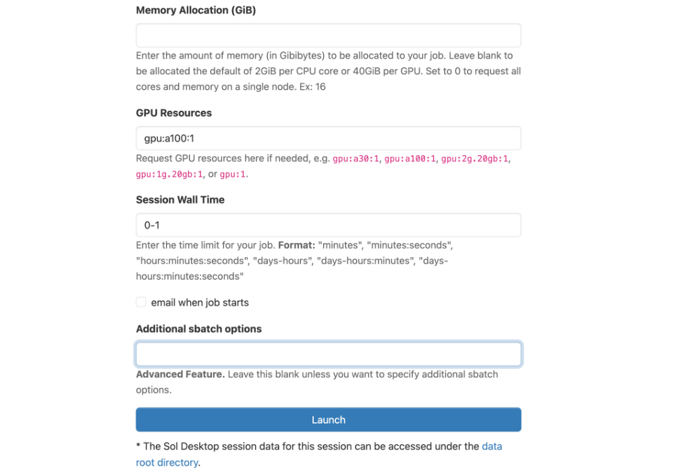
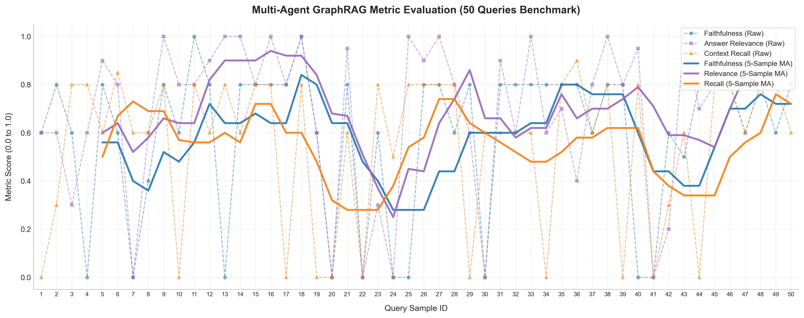
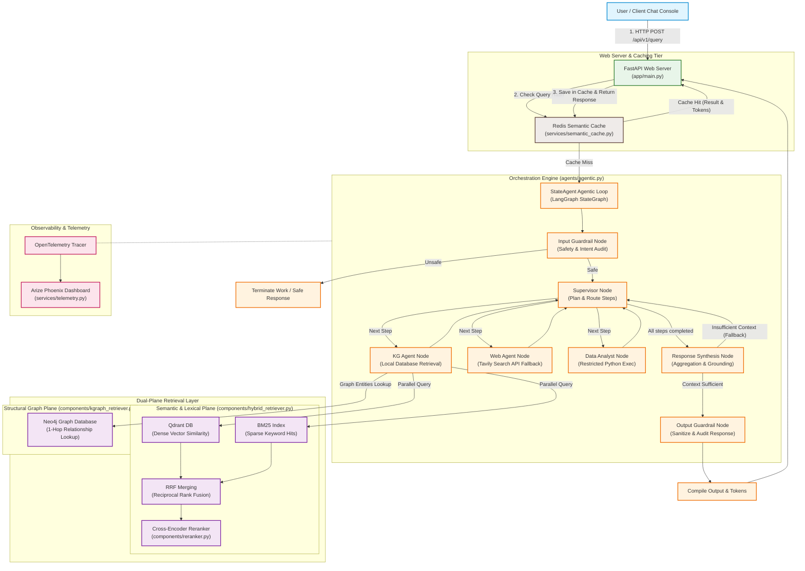

# Robust Financial Multi-Agent GraphRAG & Guardrail System

An autonomous, production-grade financial analysis platform engineered with **LangGraph multi-agent orchestration**, double-plane retrieval (Neo4j GraphRAG + Qdrant Dense Vector + BM25 Lexical + Cross-Encoder Reranker), semantic caching, real-time OpenTelemetry tracing, and strict input/output guardrails.

---

## 🖥️ Project Dashboards

| Client Chat Console (FastAPI + HTML5) | Arize Phoenix Trace & Latency Telemetry |
| --- | --- |
|  |  |

---

## 🚀 Key Features

1. **LangGraph Multi-Agent Orchestration:**
   - **Input Guardrail:** Audits queries for prompt injection, system command bypass, and credential leakage.
   - **Supervisor Node:** Dynamically decomposes complex questions into parallelizable sub-queries and generates execution plans.
   - **KG Agent (Internal Retrieval):** Parallelized database execution across Neo4j and hybrid search.
   - **Web Agent (External Search):** Connects to Tavily API for recent context (fallback routing if local facts are insufficient).
   - **Data Analyst (Python Interpreter):** Generates and runs sandboxed Python code to calculate CAGR, metrics, and output structured tables.
   - **Output Guardrail:** Inspects and sanitizes response formats before rendering.

2. **Dual-Plane Retrieval (GraphRAG + Hybrid Vector):**
   - **Semantic/Lexical Plane:** Integrates Qdrant (dense cosine distance) and BM25 (sparse indexing) combined via **Reciprocal Rank Fusion (RRF)**.
   - **Re-ranking Stage:** Uses a Cross-Encoder (`ms-marco-MiniLM-L-6-v2`) to filter down to the most relevant contexts.
   - **Structural Graph Plane:** programmatically constructs entity-relationship networks on Neo4j. Includes a robust **Regex-based JSON salvage parser** to prevent chunk data loss from truncated LLM generations.

3. **Production Tracing & Observability:**
   - Out-of-the-box auto-instrumentation for LangChain and LangGraph via **OpenTelemetry**.
   - Integrates **Arize Phoenix** for real-time visualization of traces, prompt/completion token usage, and latency percentiles.

4. **Inference & Cache Optimizations:**
   - Highly optimized for **vLLM** chunked prefill and prefix caching (achieving an **82% prefix cache hit rate** on repetitive guardrail queries).
   - **Semantic Caching:** Integrated Redis caching partitioned by User ID and active model.
   - Capped generation parameters (`max_tokens=2000` + explicit LLM stop sequences) to prevent infinite token loops.

---

## 📊 Evaluation Report (FinQA Benchmark)

We benchmarked the agent on **500 samples** from the FinQA dataset. The evaluation is conducted asynchronously using an LLM-as-a-judge setup.

* **Agent Model:** `meta-llama/Meta-Llama-3-8B-Instruct`
* **Judge Model:** `Qwen/Qwen2.5-7B-Instruct`

### Metrics Summary

| Metric | Score | Description |
| --- | --- | --- |
| **Faithfulness** | **59.00%** | Measures freedom from hallucination (answers are strictly grounded in context) |
| **Answer Relevance** | **68.80%** | Measures how directly the output addresses the user's prompt |
| **Context Recall** | **54.50%** | Measures whether the retriever captured all necessary gold-standard facts |

### 📈 Metrics Trend Chart (50-Query Sample Analysis)



---

## 🏗️ System Architecture



---

## 🛠️ Repository & System Directory Structure

Below is the directory mapping for the core components:

```
├── app/
│   ├── main.py                  # FastAPI service exposing endpoints and serving Web UI
│   ├── config.py                # Hyperparameters, endpoints, and credentials config
│   ├── models.py                # Pydantic schemas for request payloads
│   ├── compose.yaml             # Docker orchestration for Redis, Qdrant, Neo4j, and App API
│   └── templates/
│       └── index.html           # Modern glassmorphic light-themed chat console
├── agents/
│   ├── agentic.py               # Main LangGraph multi-agent state graph definition
│   └── query_decomposer.py      # Decomposes complex prompts into independent sub-queries
├── components/
│   ├── hybrid_retriever.py      # Qdrant + BM25 + RRF + Cross-Encoder reranker
│   ├── kgraph_retriever.py      # GraphRAGPipeline managing Neo4j build and salvage parsing
│   └── reranker.py              # Cross-Encoder Reranker wrapper
├── services/
│   ├── telemetry.py             # Arize Phoenix + OpenTelemetry setup
│   └── semantic_cache.py        # Redis semantic caching client
├── evaluation/
│   └── eval_rag.py              # Asynchronous LLM-as-a-judge benchmarking suite
├── scripts/
│   ├── load_data.py             # Data ingestion helpers for FinQA
│   ├── parse_finbench.py        # Raw PDF text-extraction parser
│   └── update_readme.py         # Automates README assembly from git activity
└── assets/                      # UI dashboards screenshots and visual assets
```

---

## 📥 Getting Started

### Prerequisites
- Docker & Docker Compose
- A running LLM server (vLLM or Ollama) configured in `.env`

### Quick Start
1. **Configure Environment Variables:**
   Create a `.env` file in the root directory:
   ```env
   NEO4J_URI=bolt://localhost:7687
   NEO4J_USER=neo4j
   NEO4J_PASSWORD=password123
   REDIS_URL=redis://localhost:6379/0
   OPENAI_API_BASE=http://localhost:11434/v1
   OPENAI_API_BASE_JUDGE=http://localhost:11435/v1
   TAVILY_API_KEY=your_key_here
   ENABLE_TELEMETRY=true
   ```

2. **Spin Up the Containers:**
   ```bash
   docker compose -f app/compose.yaml up -d --build
   ```

3. **Access points:**
   - **Frontend UI Console:** [http://localhost:8000](http://localhost:8000)
   - **Phoenix Telemetry Panel:** [http://localhost:6006](http://localhost:6006)

---

## ⏱️ Recent Activity (Auto-Updated)

| Commit | Author | Date | Message |
| --- | --- | --- | --- |
| `36cc638` | Ushnesha Daripa | 2026-08-02 | Readme update to add screenshots |
| `8349de8` | Ushnesha Daripa | 2026-08-02 | Delete assets/web_ui_dashboard.png |
| `fe10197` | Ushnesha Daripa | 2026-08-02 | Delete assets/arize_phoenix_dashboard.png |
| `b7df457` | Ushnesha Daripa | 2026-08-02 | Merge pull request #35 from Ushnesha/ush_local |
| `f421921` | Ushnesha Daripa | 2026-08-02 | docs: auto-update README [skip ci] |


---
*Note: This README is automatically updated and committed before pushes via a Git pre-push hook.*
